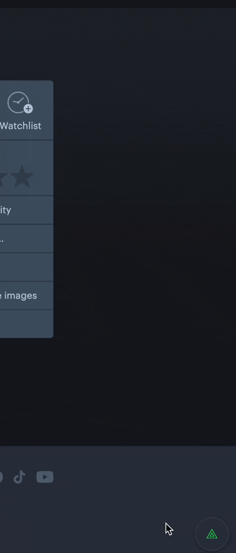

# Letterboxd Review Filter

Just like a "no junk mail" sticker on your letterbox, this userscript filters spam, joke reviews, and low-effort one-liners out of Letterboxd - so you get the film criticism without wading through Twitter-brained puns to find it.

Runs entirely in your browser. No account, no server, no data leaves your machine.

  

## AI use disclaimer

AI (Claude Sonnet 5 Medium) was used to create this project and is not present in the user script. AI is **not** part of how this program works, it is entirely self hosted and heuristics based. Thank you to friends who helped pick out bugs and improve features. I will plant 5 of my own supplied native trees this Summer as part of a wider day spent removing invasive plant species from a State Park in Western Victoria, Australia.

## Features

- **Conservative by default** - a review needs several signals to agree (short + emoji-heavy, a Twitter-ism phrase + no punctuation, etc.) before it's hidden. Length alone won't trigger it.
- **Fully tunable** - adjust strictness (Conservative / Balanced / Aggressive) from an in-page settings panel styled to match Letterboxd itself.
- **Teachable** - click "Not a joke" on a hidden review to unhide it and quietly correct the filter. Click "hide this" on any review to teach it the other way.
- **User whitelist** - always show reviews from specific people, or import your entire following list in one click.
- **Custom phrase list** - add or remove the joke phrases it looks for, right from the panel.

## Install

This is a **userscript**, not a browser extension - it runs inside a free userscript manager called Tampermonkey.

**1. Install Tampermonkey for your browser:**

| Browser | Link |
|---|---|
| Chrome | [Chrome Web Store](https://chromewebstore.google.com/detail/tampermonkey/dhdgffkkebhmkfjojejmpbldmpobfkfo) |
| Firefox | [Firefox Add-ons](https://addons.mozilla.org/en-US/firefox/addon/tampermonkey/) |
| Edge | [Microsoft Edge Add-ons](https://microsoftedge.microsoft.com/addons/detail/tampermonkey/iikmkjmpaadaobahmlepeloendndfphd) |
| Safari | [Mac App Store](https://apps.apple.com/us/app/tampermonkey/id1482490089) |
| Other browsers | [tampermonkey.net](https://www.tampermonkey.net/) |

**2. Install the script:**

- Click the Tampermonkey icon in your toolbar → **Dashboard**
- Click the **+** (Create a new script) tab
- Delete the placeholder code, paste in the contents of [`letterboxd-review-filter.user.js`](letterboxd-review-filter.user.js)
- Save (`Ctrl+S` / `Cmd+S`)

That's it - it activates automatically on any `letterboxd.com` page.

## Usage

Click the small circular button in the bottom-right corner of any Letterboxd page to open settings:

- **Strictness** - how aggressively reviews get hidden
- **Custom phrases to catch** - one phrase per line
- **Always show these users** - a manual whitelist, plus a button to import everyone you follow
- **Reset all learning** - wipes all tuning and starts fresh

Hidden reviews collapse into a slim bar with **Show** and **Not a joke** buttons. Hovering any visible review reveals a small **hide this** button in the corner.

## How it works

Each review is scored against a set of heuristics - length, emoji density, "internet voice" phrasing, known joke/meme phrases, and the presence (or absence) of actual film-critique vocabulary. If the score crosses your chosen threshold, it's hidden. Every correction you make nudges the underlying weights, so it gets a little sharper the more you use it.

## Limitations

- Pure heuristics, _no AI_ - it won't catch every joke, and very occasionally it'll misjudge a genuinely short, punchy review. That's the trade-off for something fast, free, and fully local.
- Letterboxd's page markup can change over time; if hiding stops working after a site update, open an issue with a copy of one review's HTML (right-click → Inspect → Copy outerHTML) and it can be patched.

## License

MIT — see [LICENSE](LICENSE).
